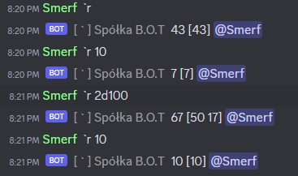

RPGamer - RPG Sessions bot

Did you ever got tired of scheduling RPG Sessions for your players?
Or maybe you are one of the players who want to schedule 
next session, but it's too difficult to plan it ahead?

Worry not, because here's a solution to your problem.
Introducing Discord Bot which can help you organise,
play and help you with your worries.

Main features:

**Session planning**

You can ask bot to make a voting urn on your server!
Other players will only click reactions representing
dates they can play. That's it, it only takes one
click to vote!

You can even mention people who didn't vote to remind them about it!

But with a good voting system comes great responsibility! Or... should.
How can we actually tell if particular session (different users 
can play different sessions) can be done with this voting?
You can create summary for every registered session!

**Youtube music**

Good gameplay have to be supported by good soundtrack.
And good soudtrack have to be played on something, or by something.
This bot can play your youtube music when you tell it to!

Ah, and also, bot provides you with music queue so you can stack
your music on top of another and skip them if desired!

But what if you doesn't have the exact link to your favourite video
and you still want to play it through bot, without searching in browser?
This can also be done! Just type the same phrase which you would
type into youtube!

**Rolling dices**

I almost forgot about the most important part of RPG sessions.
DICES! And I mean, all kinds of them. D6, D100, D10 etc.
This bot can do random rolls for you as well!

If one of the players argue about injustice in rolls,
there should be a mechanism to determine it. Maybe dices were
bad for them or the inappropriate rolls appeared in inappropriate time
and dices are innocent?

